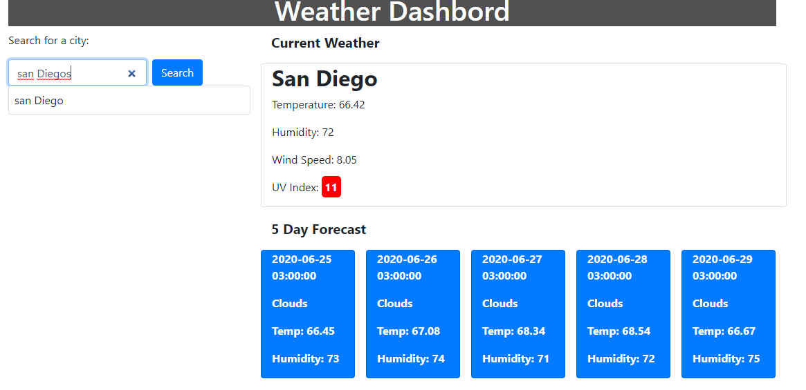

## What is the Weather Dashboard?

Search for the weather for any city! You will get the current weather as well as a 5 day forecast. The weather will include current temperature, humidity, and the UV Index!

## How it works

The weather dashboard uses an API from Openweathermap.org. Based off the user's input the API will return the weather for the city they chose.
Every new city search will be saved onto their local storage and the most recently searched one will be displayed again upon return to the site.

## Concepts used for the Weather Dashboard

- Making API calls and manipulating the data to display on the page
- Using local storage to store user data
- Rendering HTML elements dynamically onto the DOM

## Link to the Weather Dashboard

https://tlam1288.github.io/Weather-dashboard/

;
